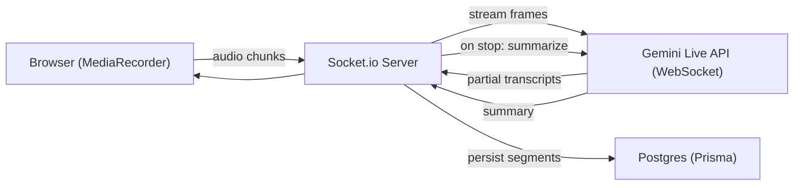

## Architecture (Mermaid)

## 200-word scalability excerpt
For hour-long meetings we rely on client-side chunking (30s default). This prevents browser memory exhaustion and enables streaming to a backend queue where each chunk is converted to the model-accepted format and forwarded to the Gemini Live API for low-latency partial transcripts. The server uses bounded queues per session; when queue depth exceeds a threshold, the client receives backpressure signals to slow chunking and temporarily buffer locally. For reliability, chunks are persisted to a temporary object store (e.g., Supabase storage or S3) as soon as possible; if a worker fails or the model call times out, the persisted chunk can be retried by another worker. Horizontal scaling is achieved using a Socket.io Redis adapter with sticky sessions and a pool of Gemini proxy workers that recycle WebSocket sessions to balance concurrent load. This hybrid design balances latency (incremental updates) and reliability (persistent chunks) while keeping costs predictable since audio is streamed and billed incrementally rather than sending massive, single uploads.
